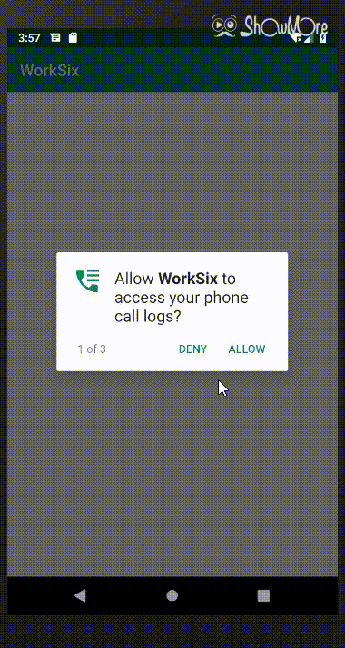

# 第六次红岩作业

## TabLayout+Fragment+PagerView的实现

建立三个fragment一一对应"呼入电话”，“呼出电话”，“未接电话”，然后tab和fragment绑定，其中fragment用一个fragmentFractory来进行管理。

## 通话数据的获取

数据通过ContactMessager来获取,通过callback回调。

## 权限请求

 一开始就给出需要请求的权限，在判断权限是否被给予的条件下判断是否要申请权限。

## 拨打电话和发送信息

在CallAdapter中的OnBind方法中设置点击事件，弹出alerlog然后进行相应的操作。

## 效果展示(UI丑哭了)

